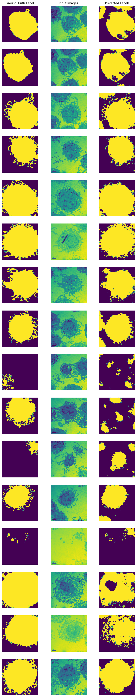

# UNET
An implementation of a basic U-NET for segmentation of cell images.

## Introduction
This is a basic implementation of the U-NET segmentation model. 
## Architecture
The architecture is based from the paper: [U-Net: Convolutional Networks for Biomedical Image Segmentation](https://arxiv.org/pdf/1505.04597.pdf). It consists of two blocks a contracting block and an expanding block. The contracting block downsamples the image, reducing its dimensions by applying convolution and max pooling operations onto it. The expansive path decodes the features generated by upsampling the inputs to produce a segmentation map.

## Data 
The dataset sampled for the task of segmentation has been listed in the data\cells folder. It consists of 38 samples of ground truth masks and cell images. 
### Data Augmentation
To increase the number of samples and to improve model performance, four data augmentation techniques were employed. They are:
  1. Flipping Image: 
    1. Horizontal
    2. Vertical
  2. Rotating Image
  3. Adjust Gamma
  
## Training
Training and testing was done for 100 epochs with a learning rate of 0.0005. Training was done on 150 immages while testing was implemented on 20. 

## Results
The model produced relatively good results. With an average accuracy of 78%. The results showcase the ground truth mask, the images sampled for testing and the segmentation masks generated by the UNET model.

